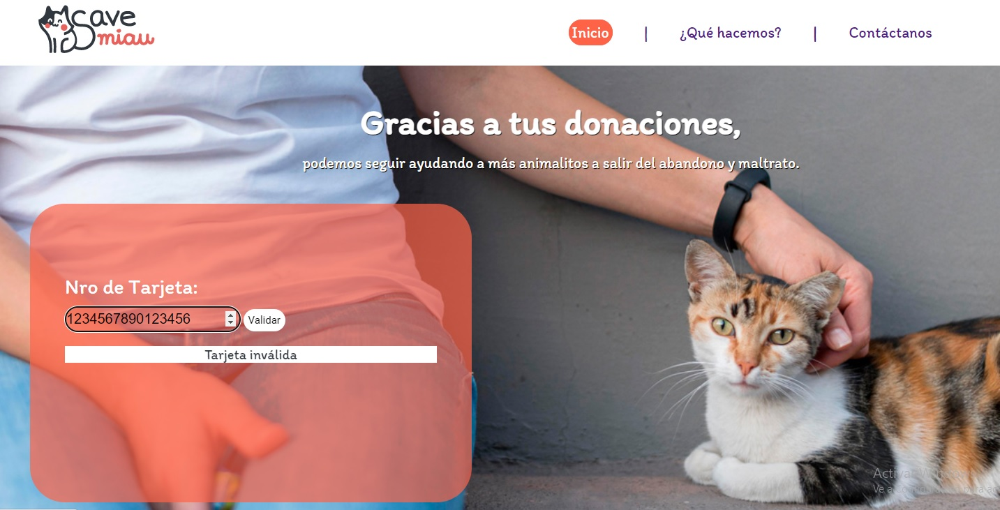
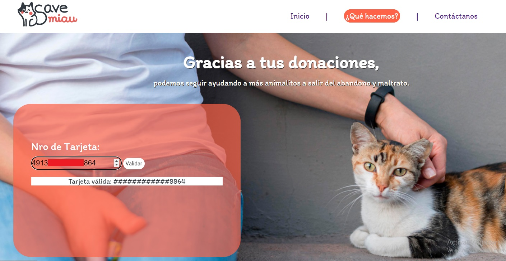

## Proyect 1
# "Card Validation"

  
 ### Creado por [Analiz Anaya](https://github.com/analizanaya)
 

 ## Índice

[1. Acerca del Proyecto](#acerca-del-proyecto)

[2. Lenguaje de programación](#lenguaje-de-programación)

[3. Objetivos de aprendizaje](#objetivos-de-aprendizaje)

[4. Producto Final](#producto-final)

 ## Acerca del Proyecto

 Bienvenidos a mi primer proyecto de Laboratoria, elaborado con la finalidad de conocer y aplicar conceptos básicos de programación. 
 
 El proyecto consiste en elaborar un input donde el usuario inserte el número de tarjeta de crédito para luego validarla.

 

 ## Lenguaje de Programación

* Javascript
* HTML
* CSS

 

## Objetivos de aprendizaje

HTML

  * Uso de HTML semántico

Web APIs

  * Uso de selectores del DOM
  * Manejo de eventos del DOM (listeners, propagación, delegación)
  * Manipulación dinámica del DOM

 

JavaScript

 * Uso de condicionales (if-else, switch, operador ternario, lógica booleana)
 * Uso de bucles/ciclos (while, for, for..of)
 * Funciones (params, args, return)
 * Pruebas unitarias (unit tests)
 * Módulos de ECMAScript (ES Modules)
 

 

CSS

 
 * Uso de selectores de CSS

 

## Producto final

### **Criterios de acceptación**

* Permitir insertar el número de la tarjeta que se quiere validar (texto) en un campo de texto vacío.
* Evitar que puedan escribir caracteres que no sean numéricos (dígitos 0-9).
* Impedir que se intente validar si es que el campo está vacío (no se ha escrito nada).
* Comunicar a la usuaria si se trata una taerjeta válida o no.
* Ocultar todos los dígitos del número de tarjeta con exepción de los últimos 4 caracteres.

 

 <h2>Tarjeta inválida</h2>

 

 <h2>Tarjeta válida</h2>

